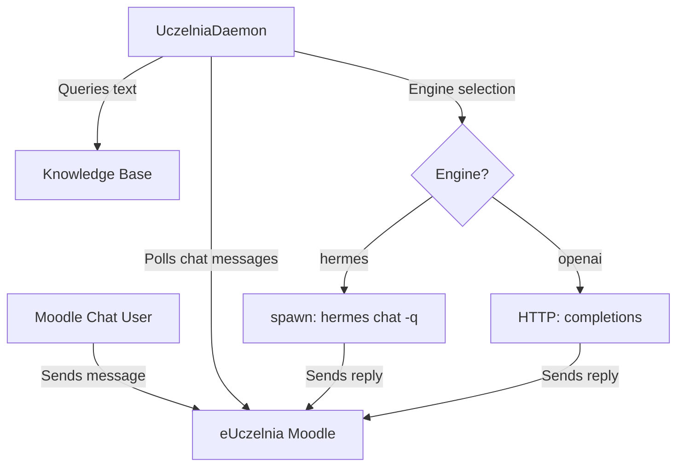

# eUczelnia Bridge

An AI assistant integration for the university e-Uczelnia Moodle messenger chat. It automates CAS authentication, extracts active sessions, and starts a polling daemon that feeds conversation messages into a completions engine.

*Note: This skill was designed for and tested primarily using the **Hermes** agent loop.*

> [!TIP]
> **TL;DR**: To connect to eUczelnia, point your AI agent at this repository/folder and it will figure the installation and setup out automatically.

---

## What is this?
eUczelnia Bridge is a self-contained automation system that acts as an intelligent intermediary between your university Moodle chat and an AI language model. It includes Playwright automation to securely log into the university's CAS portal, capture session cookies, and spawn a lightweight background daemon that polls a chat thread and replies to messages automatically.

It supports two completions backend engines:
1. **Hermes (Default)**: Routes Moodle messages through the local `hermes chat -q` CLI subprocess, giving the chatbot full access to the Hermes agent loop (including web searching, file access, code execution, skills, and multi-turn reasoning).
2. **OpenAI Fallback**: Connects directly to any OpenAI-compatible HTTP completions endpoint (Ollama, local proxy, OpenAI, etc.).

---

## Why use this?
- **Automated Responses**: Run a 24/7 AI tutor, student assistant, or responder directly inside any Moodle chat without keeping a browser window open.
- **Hermes Agent Capabilities**: Give Moodle chat participants access to a full agent loop that can solve problems, run python scripts, or look up information.
- **Contextual Memory**: Maintain continuous, multi-turn conversations using local SQLite databases for chat history.
- **Local Knowledge Integration**: Instantly reference syllabus docs, lecture notes, or project guides using an integrated standard-library TF-IDF search database.
- **Dynamic Control**: Change AI behavior, swap models, clear history, or inspect status directly in the chat using Moodle-native text commands.

---

## Architecture Overview



---

## Requirements

- **Python**: 3.11 or newer
- **Playwright**: For automated Casper (CAS) headless login
- **Dependencies**: Listed in `requirements.txt`
- **Hermes CLI** (Optional, for Hermes engine): Installed on the local system path or at `~/.hermes/`

---

## Quick Start (5 Steps)

### 🤖 AI Agent Auto-Installation & Setup (Recommended)
If you are using an AI coding or agent assistant (such as Hermes):
Simply send a link to this repository/folder to your agent and say:
> *"Install this skill/bridge and set it up for me."*

The agent will read the guidelines in `SKILL.md` and handle the entire setup automatically.


### Manual Installation
If you prefer to set up manually, clone this package and run the installation script:
```bash
bash install.sh
```

### Step 2: Configure Credentials & Engine
Edit `config/config.json` to select your completions engine. The default setting is `"engine": "hermes"`.
If using the `"openai"` fallback engine, configure your API gateway credentials:
```json
{
  "engine": "openai",
  "ai_gateway": {
    "base_url": "https://api.openai.com/v1",
    "api_key": "your-openai-api-key",
    "model": "gpt-4o-mini"
  }
}
```

Edit the `config/.env` file and insert your CAS credentials:
```env
EUCZELNIA_USERNAME=your_cas_username
EUCZELNIA_PASSWORD=your_cas_password
```

### Step 3: Run CAS Login
Run the browser automation to obtain an active session key and session cookies:
```bash
./venv/bin/python login/login.py --output data/session.json
```
This writes session credentials to `data/session.json`.

### Step 4: Resolve Conversation ID
List your conversations to obtain the target `conversation_id`:
```bash
./venv/bin/python -c "
import json
from eUczelniaMessenger import MessengerClient, SessionData
with open('data/session.json') as f:
    s = json.load(f)
client = MessengerClient(SessionData(sesskey=s['sesskey'], cookies=s['cookies'], user_id=s['user_id']))
for c in client.get_conversations(limit=10).conversations:
    print(f'ID: {c.id} | Name: {c.name}')
"
```

### Step 5: Start the Daemon
Launch the daemon in the background to begin monitoring the conversation and generating AI completions:
```bash
SESSKEY=$(./venv/bin/python -c "import json; print(json.load(open('data/session.json'))['sesskey'])")
USER_ID=$(./venv/bin/python -c "import json; print(json.load(open('data/session.json'))['user_id'])")
COOKIE_NAME=$(./venv/bin/python -c "import json; print(list(json.load(open('data/session.json'))['cookies'].keys())[0])")
COOKIE_VALUE=$(./venv/bin/python -c "import json; print(list(json.load(open('data/session.json'))['cookies'].values())[0])")

# Use --engine hermes (default) or --engine openai
nohup ./venv/bin/python daemon/daemon.py \
  --conversation-id <CONV_ID> \
  --user-id "$USER_ID" \
  --sesskey "$SESSKEY" \
  --cookie-name "$COOKIE_NAME" \
  --cookie-value "$COOKIE_VALUE" \
  --engine hermes \
  --user-prompt "You are a helpful programming tutor." \
  > data/daemon.log 2>&1 &
```

Monitor the state of the daemon using `data/daemon_status.json`:
```bash
cat data/daemon_status.json
```

---

## In-Chat Commands

You can control the daemon directly from the Moodle chat using standard commands. Default prefix is `!`:

| Command | Arguments | Description |
|---------|-----------|-------------|
| `!help` | None | Lists available commands. |
| `!status` | None | Displays uptime, mode, message counts, active engine, and model. |
| `!mode` | `stateless` \| `context` | Switches chat memory state. |
| `!clear` | None | Clears chat memory context (only in `context` mode). |
| `!model` | `<model_name>` | Switches active completions model at runtime. |
| `!cleanup` | `on` \| `off` | Toggles automatic deletion of sent messages upon shutdown. |
| `!prompt` | `show` \| `set <text>` \| `append <text>` \| `undo` | Configures session-specific guidelines. |
| `!knowledge` | `show` | Displays loaded knowledge base files and chunk counts. |
| `!disconnect` | None | Gracefully disconnects the daemon. |

---

## Configuration Reference

Check `docs/configuration.md` for details on configuring `config/config.json`.
Check `docs/commands.md` for in-depth examples of chat commands.
Check `docs/troubleshooting.md` for CAS login issues, Playwright debugging, and Hermes CLI errors.

---

## License

This project is licensed under the MIT License. See `LICENSE` for details.
