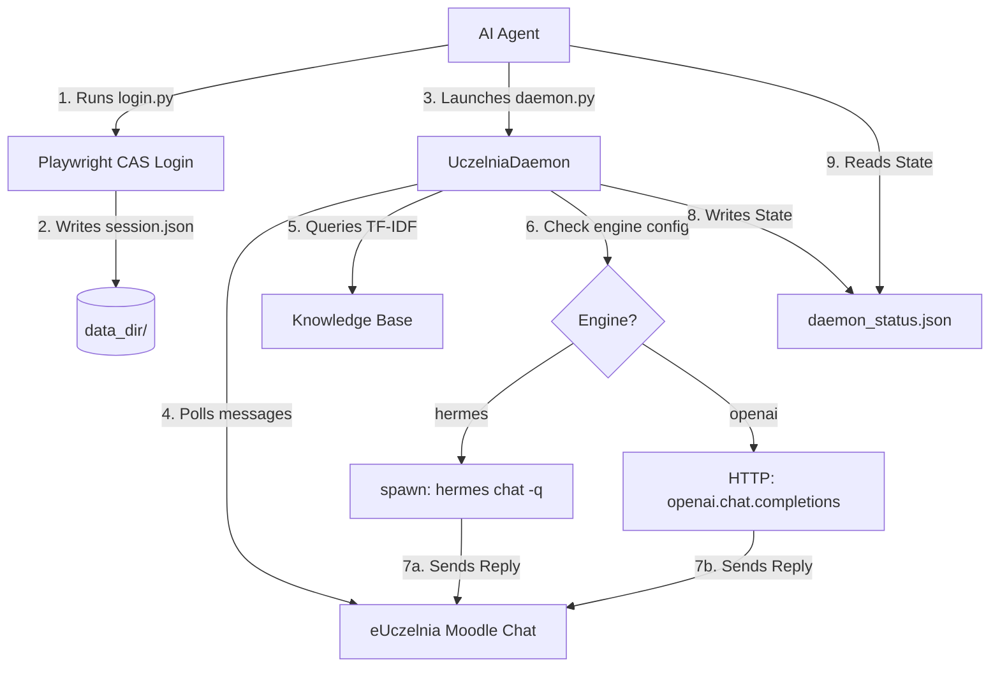

# eUczelnia Bridge — AI Agent Skill Guide

This document defines the `euczelnia-bridge` skill for AI agents (e.g., OpenClaw, Hermes, or Antigravity). It provides the exact instructions, API usage details, and operational workflows required to configure, initialize, and monitor the eUczelnia Moodle messenger daemon.

---

## 1. Overview & Architecture

`euczelnia-bridge` is a self-contained automation system that logs into the Cracow University of Economics (UEK) e-Uczelnia portal (CAS), captures active Moodle session cookies, and spawns an asynchronous daemon. The daemon polls a Moodle chat conversation and replies to incoming messages.

It supports two completions engine backends:
1. **Hermes (Default)**: Routes Moodle messages through the local `hermes chat -q` CLI subprocess, giving the chatbot full access to the Hermes agent loop (including web searching, file access, code execution, skills, and multi-turn reasoning).
2. **OpenAI Fallback**: Connects directly to any OpenAI-compatible HTTP completions endpoint (Ollama, local proxy, OpenAI, etc.).



---

## 2. Installation

Run the automated installer inside the `euczelnia-bridge/` folder:

```bash
bash install.sh
```

### Manual Installation (Fallback)
If `install.sh` fails, perform the following steps:
1. Ensure Python 3.11+ is installed.
2. Create and activate a virtual environment:
   ```bash
   python3 -m venv venv
   source venv/bin/activate
   ```
3. Install dependencies:
   ```bash
   pip install -r requirements.txt
   ```
4. Install Playwright Chromium binaries:
   ```bash
   playwright install chromium
   ```
5. Copy template files:
   ```bash
   cp config/config.json.template config/config.json
   cp config/.env.template config/.env
   ```

---

## 3. First-Time Setup

1. **Credentials**: Edit `config/.env` and insert your UEK CAS login credentials:
   ```env
   EUCZELNIA_USERNAME=your_cas_username
   EUCZELNIA_PASSWORD=your_cas_password
   ```
2. **Configuration**: Edit `config/config.json`. By default, the daemon is configured to use the `hermes` engine:
   ```json
   {
     "poll_interval_seconds": 12.0,
     "mode": "stateless",
     "max_history_turns": 20,
     "cleanup_on_disconnect": false,
     "command_prefix": "!",
     "sentinel_start": "«AI»",
     "sentinel_end": "«/AI»",
     "data_dir": "./data",
     "engine": "hermes",
     "ai_gateway": {
       "model": "deepseek-v4-flash-free"
     }
   }
   ```

   ### Switching to OpenAI Fallback
   If you want to use a direct HTTP API completions endpoint instead, change the `engine` parameter to `"openai"` and configure the gateway parameters:
   ```json
   "engine": "openai",
   "ai_gateway": {
     "base_url": "https://api.openai.com/v1",
     "api_key": "your-openai-api-key",
     "model": "gpt-4o-mini"
   }
   ```

---

## 4. Hermes Engine Details

### Dynamic Binary Path Resolution
When using `engine: hermes`, the client dynamically searches for the `hermes` CLI binary in the following order:
1. Environment variable `HERMES_BIN` (if set, e.g., `/usr/local/bin/hermes`).
2. System PATH lookup via system utilities.
3. Common virtual environment locations:
   - `~/.hermes/hermes-agent/venv/bin/hermes`
   - `~/.gemini/hermes-agent/venv/bin/hermes`
4. Fallback execution keyword `"hermes"`.

If your Hermes installation is in a custom path, configure it in the environment before launching the daemon:
```bash
export HERMES_BIN="/custom/path/to/hermes"
```

### Conversational History & Context Serialization
Since the Hermes CLI operates statelessly per execution, the daemon serializes multi-turn memory from the local SQLite database into the prompt text:
```
Conversation history:
<user>: Message turns
<assistant>: AI replies
```
Hermes reads this block as part of its instructions. The actual completions model configured inside Hermes's own configuration files will be used; the `ai_gateway.model` property in `config.json` is purely cosmetic and is only used to report active model status via `!status` commands.

---

## 5. Session Workflow (Step-by-Step)

To initialize and run this skill, follow this exact checklist:

### Step 1: Load Credentials
Verify that `config/.env` contains valid credentials. Load them or ensure they are present in the environment (`EUCZELNIA_USERNAME` and `EUCZELNIA_PASSWORD`).

### Step 2: Authenticate and Extract Session
Run `login/login.py` to automate CAS authentication and capture the active cookies/sesskey. Save the output to `data/session.json`:
```bash
./venv/bin/python login/login.py --output data/session.json
```
If the command fails, refer to [docs/troubleshooting.md](file:///Users/mshablovskyy/Python/euczelniaScrapper/euczelnia-bridge/docs/troubleshooting.md) and check `data/debug_login/` logs.

### Step 3: Determine the Target Conversation
You can resolve a target conversation by:
1. **Search**: Search for a participant name or course name to get a `conversation_id`.
2. **ID**: Use a known numeric conversation ID.
3. **Self**: Use `"self"` (creates/targets your private notes space).

Use this helper python one-liner to search or check conversation lists:
```bash
./venv/bin/python -c "
import json
from eUczelniaMessenger import MessengerClient, SessionData
with open('data/session.json') as f:
    s = json.load(f)
client = MessengerClient(SessionData(sesskey=s['sesskey'], cookies=s['cookies'], user_id=s['user_id']))
# List top 5 conversations:
for c in client.get_conversations(limit=5).conversations:
    print(f'ID: {c.id} | Name: {c.name} | Unread: {c.unread_count}')
"
```

To create or fetch the `"self"` conversation ID:
```bash
./venv/bin/python -c "
import json
from eUczelniaMessenger import MessengerClient, SessionData
with open('data/session.json') as f:
    s = json.load(f)
client = MessengerClient(SessionData(sesskey=s['sesskey'], cookies=s['cookies'], user_id=s['user_id']))
print('Self Conversation ID:', client.get_self_conversation().id)
"
```

### Step 4: Negotiate User Base Prompt
Ask the human user for the core instructions or personality guidelines they want the daemon to follow. For example:
> *"I am starting the Moodle Messenger Bridge. What system prompt instructions or constraints should the AI bot follow in this chat? (e.g., 'Be a helpful math tutor' or 'Speak only in Spanish')"*

Once resolved, proceed to Step 5.

### Step 5: Launch UczelniaDaemon
Run `daemon/daemon.py` using arguments from `data/session.json`. You can select the backend using `--engine` (`hermes` or `openai`):

```bash
# Read variables from data/session.json
SESSKEY=\$(./venv/bin/python -c "import json; print(json.load(open('data/session.json'))['sesskey'])")
USER_ID=\$(./venv/bin/python -c "import json; print(json.load(open('data/session.json'))['user_id'])")
COOKIE_NAME=\$(./venv/bin/python -c "import json; print(list(json.load(open('data/session.json'))['cookies'].keys())[0])")
COOKIE_VALUE=\$(./venv/bin/python -c "import json; print(list(json.load(open('data/session.json'))['cookies'].values())[0])")

# Run in background with hermes engine (default)
nohup ./venv/bin/python daemon/daemon.py \\
  --conversation-id <CONV_ID> \\
  --user-id "\$USER_ID" \\
  --sesskey "\$SESSKEY" \\
  --cookie-name "\$COOKIE_NAME" \\
  --cookie-value "\$COOKIE_VALUE" \\
  --engine hermes \\
  --user-prompt "Your base prompt instructions" \\
  --knowledge-file path/to/kb_doc1.md \\
  --knowledge-file path/to/kb_doc2.txt \\
  > data/daemon_stdout.log 2>&1 &
```

### Step 6: Monitor UczelniaDaemon Status
You can track the daemon's runtime status in real-time by reading `data/daemon_status.json`:
```bash
cat data/daemon_status.json
```
Expected output:
```json
{
  "status": "running",
  "pid": 58291,
  "uptime_seconds": 120.4,
  "message_count": 5,
  "mode": "stateless",
  "model": "gpt-4o-mini",
  "last_event": "startup",
  "timestamp": "2026-05-24T21:30:00.000000Z"
}
```

---

## 6. Knowledge Base (TF-IDF)

The daemon includes a built-in, lightweight text-retrieval module (`daemon/knowledge.py`) that uses TF-IDF similarity.
- **Loading Files**: Specify files using `--knowledge-file <path>` CLI options. Files should be markdown (`.md`) or text (`.txt`).
- **Retrieval Workflow**: When a batch of messages is received, the daemon searches the knowledge base with the query. The top 3 matching text paragraphs are injected into the system prompt under `Relevant knowledge context:`.
- **Inspection**: Chat participants can type `!knowledge show` in the Moodle chat to view a list of loaded knowledge files.

---

## 7. Scheduled Sessions (Cron)

To set up recurring sessions or run the daemon on a schedule:
1. Create a script `run_scheduled.sh` that loads credentials, runs `login.py`, extracts session keys, and executes `daemon.py` with a timeout or run duration.
2. Schedule it using cron (`crontab -e`):
   ```cron
   # Start the daemon every weekday at 8:00 AM
   0 8 * * 1-5 /bin/bash /path/to/euczelnia-bridge/run_scheduled.sh
   ```

---

## 8. In-Chat Commands Reference

Participants can control the daemon directly from the Moodle chat using the configured command prefix (default `!`).

| Command | Args | Description |
|---------|------|-------------|
| `!help` | None | Displays help menu showing all commands. |
| `!status` | None | Displays operating mode, uptime, message count, and active model. |
| `!mode` | `stateless` \| `context` | Switches the conversational memory mode. |
| `!clear` | None | Clears multi-turn message history context (only in `context` mode). |
| `!model` | `<model_name>` | Changes the model used by the completions endpoint. |
| `!cleanup` | `on` \| `off` | Toggles deletion of sent messages on disconnect. |
| `!prompt` | `show` \| `set <text>` \| `append <text>` \| `undo` | Inspects, updates, or reverts session-specific instructions. |
| `!knowledge` | `show` | Displays loaded knowledge base files and chunk counts. |
| `!disconnect` | None | Gracefully shuts down the daemon. |

For detailed behavior of each command, refer to [docs/commands.md](file:///Users/mshablovskyy/Python/euczelniaScrapper/euczelnia-bridge/docs/commands.md).
